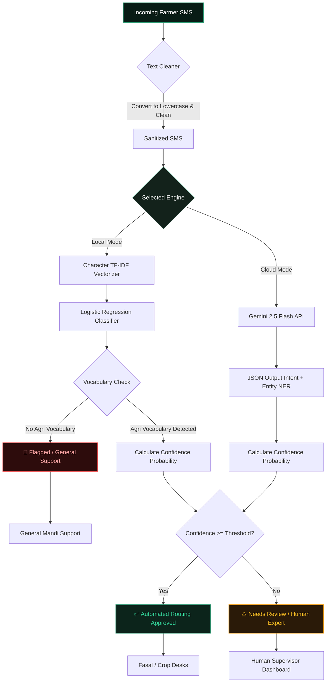

# 🌾 Agri-SMS Sentinel & Moderator 🛡️

<div align="center">
  <!-- Animated Typing SVG Header -->
  
  
  <p align="center">
    <strong>A State-of-the-Art Hybrid AI Ingestion, Filtering, and Routing Command Center for Regional Farmer Queries.</strong>
  </p>

  <!-- Badges -->
  
  
  
  
</div>

---

## 🗺️ System Architecture & Workflow

The diagram below outlines the ingestion, classification, safety thresholding, and routing logic inside the application:



---

## 🎯 Executive Overview & Core Q&A

| ❓ Core Question | 💡 Structured Visual Answer |
| :--- | :--- |
| **What is this project for?** | 📂 **Central Command Router** designed for Kisan (Farmer) Help Desks:<br>• **Ingests** agricultural SMS queries.<br>• **Categorizes** them automatically (Market, Disease, Weather, Advice, Subsidy).<br>• **Filters out** spam and non-farming conversations.<br>• **Extracts** entities (crops, locations, chemical names). |
| **What problem has it solved?** | 🛠️ **Language & Quality Barrier Resolution:**<br>• **Hinglish/Transliterated Texts:** Parses sentences like `"aloo ka bhav kya hai"` or `"rain tomorrow mosam forecast"`.<br>• **Typos:** Robust character-level subword n-gram tokenization ignores spelling errors.<br>• **Spam Inundation:** Stops irrelevant support volume from entering specialized desks. |
| **Who can use it perfectly?** | 👥 **Target Audience & Operators:**<br>• **Kisan Call Centers (KCC):** Auto-routers to dispatch inquiries.<br>• **Agri NGOs:** Automated SMS helpline portals.<br>• **Government Agriculture Ministries:** Real-time mandis dashboard routers. |
| **How is the app more reliable?** | 🛡️ **Fail-Safe Mechanism:**<br>• **Local Offline Core:** Works without internet using Logistic Regression.<br>• **Confidence Thresholding:** Routes automatically *only* above customizable threshold (e.g., 70%).<br>• **Deterministic Fallback:** Flags low-confidence predictions to human expert moderators. |

---

## 💎 Features Grid

### 🌾 Farmers SMS Portal
* **Single Query Router**: Ingest single SMS queries, parse texts, and view real-time automated department desk targets.
* **NER Extraction**: Gemini-backed entity recognition lists crops, materials, and mandis.
* **Explanation Engine**: Highlights classification reasons clearly in natural language.

### 🛡️ Moderator Command Center
* **Bulk Processing**: Upload `.csv` batches of farmer SMS inputs to moderate multiple records simultaneously.
* **Live Status Marking**: Visual tags indicating whether a query is `✅ Routed Automatically`, `🚨 Flagged / Spam`, or `⚠️ Needs Review`.
* **Exporting**: Download fully parsed, moderated batch CSVs in one click.

### 📊 System Analytics
* **Accuracy Counter**: Live tracking of model performance metrics (98.5% default benchmark).
* **Avg Latency Tracker**: Fast local processing checking response speeds (1.2 ms).
* **Auto-Approval Rate**: Shows the percentage of queries routed automatically vs. sent to human queue.

---

## 🚀 Setup & Installation Guide

Follow these steps to run the application locally on your machine.

### 1. Prerequisite Installations
Ensure you have Python 3.9 or higher installed. Verify by running:
```bash
python --version
```

### 2. Clone and Setup Environment
Navigate into your project folder and activate a virtual environment:
```bash
# Create virtual environment
python -m venv venv

# Activate on Windows
.\venv\Scripts\activate

# Activate on macOS/Linux
source venv/bin/activate
```

### 3. Install Dependencies
Install all required libraries including Streamlit, Scikit-Learn, and Pandas:
```bash
pip install streamlit pandas numpy scikit-learn requests
```

### 4. Train Local Classifier Models
Before running the app, train the sub-word TF-IDF Vectorizer and Logistic Regression models. This reads from `farmers_dataset.csv` and serializes the `.pkl` files:
```bash
python train_model.py
```
*Expected Output:*
```text
[INFO] Starting model training pipeline...
[INFO] Loaded dataset with 4000 records.
[INFO] Cleaning SMS query texts...
[INFO] Fitting TF-IDF Vectorizer (Character n-grams 2-5)...
[INFO] Vocabulary size (n-grams count): 72785
[INFO] Training Logistic Regression Classifier...
[INFO] Training completed. Test Accuracy: 98.50%
[SUCCESS] Saved tfidf_vectorizer.pkl and intent_classifier.pkl.
```

### 5. Launch Glassmorphic UI Dashboard
Spin up the Streamlit server locally:
```bash
streamlit run app.py
```
Open [http://localhost:8501](http://localhost:8501) in your browser to view the application.

---

## 🧪 Testing & Validation Matrix

To guarantee maximum reliability, verify the following inputs:

| Input SMS Query | Expected Category | Expected Target Desk |
| :--- | :--- | :--- |
| `"wheat price today mandi rate in punjab"` | **market** | Agronomy Markets & Price Commission (Mandi Rates) |
| `"cotton crop leaf yellowing and spots"` | **disease** | Plant Pathology Department (Crop Diseases & Pests) |
| `"will it rain tomorrow in haryana"` | **weather** | Agricultural Meteorology Service (Weather Forecasts) |
| `"PM kisan loan scheme application form"` | **subsidy** | Agricultural Finance & Government Schemes |
| `"best fertilizer urea or dap for sugarcane"` | **advice** | Agricultural Extension & Crop Management |
| `"can you recommend a good movie to watch?"` | **spam** | Blocked / General Mandi Support (General Inquiries) |

---

## 🛠️ Code Structure

```text
├── app.py                # Main Glassmorphic Streamlit Dashboard
├── utils.py              # Text cleaners & Vocabulary-matching filters
├── train_model.py        # Model training script (TF-IDF + Logistic Regression)
├── generate_dataset.py   # Dataset generator script
├── farmers_dataset.csv   # Dataset records (Intent / Text pairs)
├── tfidf_vectorizer.pkl  # Trained Vectorizer (Serialized)
└── intent_classifier.pkl # Trained Classifier Model (Serialized)
```

---

## 🎨 Premium Styling Architecture

The application implements a premium CSS injection layer inside `app.py` for design consistency:
* **Frosted Backgrounds**: Elements are rendered with `background: rgba(255, 255, 255, 0.02)` and `backdrop-filter: blur(16px)`.
* **Smooth Transitions**: Elements dynamically slide, fade, and scale upon cursor hover.
* **Visual Hierarchy**: Features gradient text colors with Outfit font and clean outlines to separate operational panels from output statistics.
